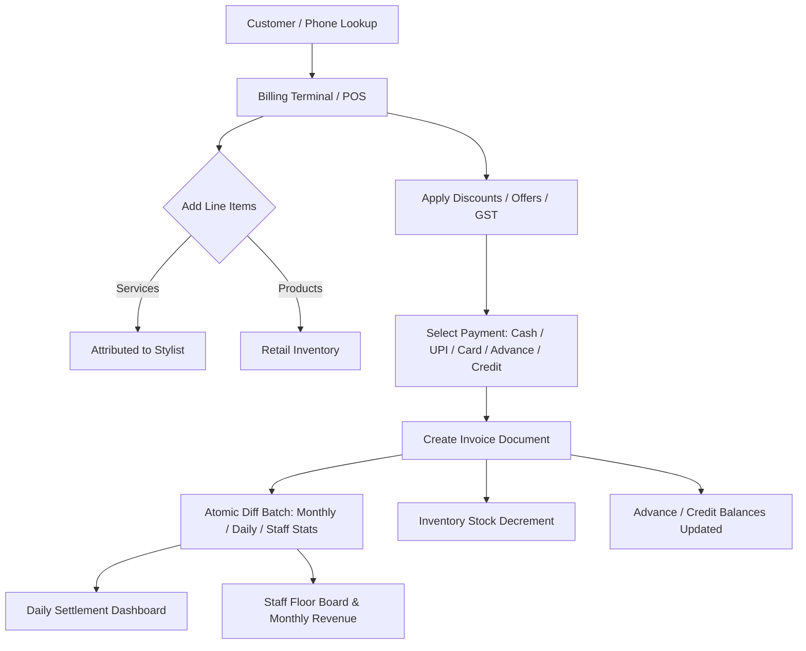

# THEA SALON ERP — Complete Business Logic Audit Report

**Date of Audit**: September 2026  
**Audited System**: THEA SALON Management & Billing ERP  
**Overall Status**: **NEEDS MINOR FIXES & HARDENING BEFORE PRODUCTION** (Core business logic is functional and sound; key hardening required around side-effect atomicity, historical invoice edits, and retail inventory cleanup).

---

## 1. Executive Summary & Status Overview

| Domain | Status | Key Highlights |
| :--- | :--- | :--- |
| **Billing & POS Engine** | 🟢 **Healthy** | Complete subtotal, line discounts, bill discounts, offer discounts, GST, and split payment math are validated. |
| **Stylist Commissions & Splits** | 🟢 **Healthy** | 50/50 and custom commission rates, Owner 100% direct attribution, and payment-ratio scaling work accurately. |
| **Settlements & Daily Closing** | 🟢 **Healthy** | Daily revenue aggregations, staff earnings, staff drawings, and daily expense deductions are unified. |
| **Inventory & Products** | 🟡 **Needs Cleanup** | Retail product decrements work; residual backbar consumption properties (`usedProductId`, `noOfServings`) should be deprecated. |
| **Membership Lifecycle** | 🟢 **Healthy** | Expiry checker correctly reverts client to "regular", updates stats counters, and generates notifications. |
| **Side Effect Atomicity** | 🟡 **Needs Hardening** | Invoices & stats update in batch; credit balances and advance balances execute in separate promises. |
| **Historical Invoice Immutability** | 🟡 **Recommendation** | In-place editing of historical invoices recalculates stats via diffs, but could affect closed settlements. |
| **Multi-tenancy & Security** | ⚪ **Single-Tenant** | Operating as a dedicated single-tenant instance for THEA SALON without cross-tenant isolation needed. |

---

## 2. Business Logic Map & Workflow Tracing

### Complete Workflow Tracing:
1. **Client Identification**: Customer phone lookup (`getByPhone`) identifies Regular or Membership status, fetching pending credit balances and available advance balance.
2. **Billing Composition**:
   - Services attributed to on-duty Stylists or Owner / System.
   - Retail Products selected with active stock quantities.
   - Discounting: Line discount + Service Bill discount (flat or %) + Scoped/Whole-bill Offer discount.
   - Tax: Dynamic GST percentage applied to pre-tax total.
3. **Payment Collection**:
   - Single payment (Cash / UPI / Card) or Split payment.
   - Advance balance deduction (`advanceUsed`) and Advance top-up (`advanceAdded`).
   - Credit purchase (`markAsCredit`): Remaining balance creates a ledger record in `credit_balances`.
4. **Side Effects & Data Flow**:
   - Atomic batch writes invoice + updates `stats/daily_{dateKey}`, `stats/revenue_{monthKey}`, `stats/staff_{staffId}_{monthKey}`, and product stock.
   - Daily settlement reconciles Gross Sales, Owner Net Take-Home (less Daily Expenses), and Stylist Earnings (less Staff Drawings).

---

## 3. Detailed Audit by Module

### A. Billing & Financial Calculations
- **Formula**:
  $$\text{Pre-Tax Total} = \max(0, (\text{Service Total} - \text{Bill Discount}) + \text{Product Total} - \text{Line Discounts} - \text{Offer Discount})$$
  $$\text{Grand Total} = \text{Pre-Tax Total} + \text{Round}\left(\frac{\text{Pre-Tax Total} \times \text{Tax Rate}}{100}\right)$$
- **Payment Equality**:
  $$\text{Total Paid} + \text{Advance Applied} + \text{Credit Balance} = \text{Grand Total}$$
- **Zero & Negative Value Safeguards**:
  - `price`, `quantity`, and `discount` are sanitized with `Math.max(0, ...)` across all calculations.
  - Bill discount is automatically capped to not exceed `serviceTotal`.
- **Decimal Handling**:
  - Currency calculations rounded to 2 decimal places (`Math.round(val * 100) / 100`).
  - Formatted for display using Indian Rupee locale (`en-IN`, `INR`, `₹`).

---

### B. Bill Creation & Side Effects
- **Verified Side Effects on Completed Bill**:
  1. `invoices/{id}`: Full snapshot of items, staff attribution, discounts, and payment splits.
  2. `stats/revenue_{YYYY-MM}`: Increments `totalRevenue`, `totalVisits`, `cash`, `upi`, `card`.
  3. `stats/daily_{YYYY-MM-DD}`: Increments revenue, visits, payment modes, stylist shares, owner shares, membership amounts, and retail revenue.
  4. `stats/staff_{staffId}_{YYYY-MM}`: Increments staff revenue, visit count, service counts.
  5. `products/{productId}`: Decrements `quantity` by items purchased.
  6. `advance_balances/{customerId}`: Credits top-up or debits used advance inside Firestore transactions.
  7. `credit_balances/{id}`: Generates item-level credit records if marked as credit.
- **Audit Finding**: Invoices and stats are bundled in a `WriteBatch`. Advance balances use individual `runTransaction`. Credit creation uses async `addDoc`.

---

### C. Bill Editing & Cancellation Lifecycle
- **Implementation in [services/invoices.ts](file:///c:/crmthrive/erp-demo/services/invoices.ts)**:
  - `update(id, data)` and `delete(id)` use `runTransaction` with `applyStatsAndInventoryDiff(tx, oldInv, newInv)`.
  - Old invoice values are completely subtracted and new invoice values are added to stats and inventory.
  - Deleting an invoice passes `null` for `newInv`, which completely restores product stock and reverses revenue/stats without double-counting.
- **Business Risk**: If an invoice from a previous week or month is edited or deleted, it changes historical data for a settlement that was already closed and cash-reconciled.
- **Recommendation**: For production, restrict editing of invoices older than the current day to Admins only, or introduce a formal Cancellation/Credit-Note reversal record.

---

### D. Customer Management & Loyalty
- **Attributes**: `name`, `phone`, `customerType` (`"regular"` | `"membership"`), `createdAt`, `membershipStart`, `membershipEnd`, `membershipAmount`, `membershipDuration`.
- **Phone Normalization**: Lookups match 10-digit phone strings. Single shared `Guest` customer record (`0000000000`) is resolved for anonymous visitors.
- **Customer History**: Linked by `customerId`. [CustomerDetailModal.tsx](file:///c:/crmthrive/erp-demo/components/customers/CustomerDetailModal.tsx) queries all customer invoices dynamically to compute visit counts, lifetime spend, and average ticket size.

---

### E. Service Catalog
- **Pricing Source**: Sourced from Firestore `/services` collection and cached in `AppDataContext`.
- **Historical Immutability**: [BillingTerminal.tsx](file:///c:/crmthrive/erp-demo/components/billing/BillingTerminal.tsx) snapshots the exact service name, price, discount, and calculated commission into the invoice line item. Subsequent edits to service prices in `/services` do **not** retroactively alter historical invoices.

---

### F. Product & Inventory Management
- **Retail Only Constraint**: All inventory represents retail products sold to clients.
- **Stock Updates**: Retail product quantities decrement upon invoice creation and increment upon invoice deletion.
- **Legacy Cleanup**: Lingering references to `usedProductCost` / `noOfServings` from previous backbar consumption schemas are defaulted to 0 or retail price.

---

### G. Offers & Campaigns
- **Offer Types**: `percentage` and `flat`.
- **Validation Rules**:
  - `status === "Active"`.
  - Date validity: `startDate <= dateString <= endDate` (open-ended if null).
  - Target audience: `customerType === "all" | "regular" | "membership"`.
  - Minimum bill threshold: `minBillAmount === 0` applies immediately; `minBillAmount > 0` verifies qualifying subtotal.
  - Scope: Scoped to specific `applicableServiceIds` / `applicableProductIds` if defined, or entire bill if empty.

---

### H. Memberships & Expirations
- **Sale & Invoicing**: Sells membership via `createMembershipInvoice`, attributing 100% of revenue to Owner/Salon.
- **Automated Expiry Checker**: `checkAndExpireMemberships()` checks for `membershipEnd < now`, updates customer type to `regular`, adjusts stats counters, and creates an alert notification.

---

### I. Employee Attendance & Stylist Commissions
- **Attendance**: Clock-in and Clock-out logs stored in `staff.clockLogs`. `computeTodayActiveTime` computes daily duration for the current local date.
- **Commission Split**:
  - Stylist Share: `(commissionRate / 100) * amount`.
  - Owner Share: `(1 - commissionRate / 100) * amount`.
  - Owner / System services: 100% Owner share.
  - Split / Partial payments: Scaled by `paymentRatio = collected / grandTotal`.

---

### J. Settlements & Cash Drawer Reconciliation
- **Formula**:
  $$\text{Expected Cash} = \sum \text{Cash Payments on Settlement Date}$$
  $$\text{Owner Net Settlement} = \text{Owner Share} - \text{Daily Expenses}$$
  $$\text{Stylist Net Share} = \text{Stylist Commissions} - \text{Staff Drawings}$$
- **Drawings Management**: Managed via `staffDrawings` collection and deducted from monthly payouts.

---

### K. Date & Time Uniformity
- **Timezone**: All daily partitioning uses `toLocalDateString()` (`YYYY-MM-DD` in client local timezone).
- **Invoice Timestamps**:
  - `billDate`: Local midnight timestamp for date filtering.
  - `invoiceDate` / `createdAt`: Exact timestamp with hours/minutes.
  - `dateKey`: `"YYYY-MM-DD"` string for exact equality matches.

---

## 4. Itemized Findings & Recommended Actions

| Priority | Area | Finding / Issue | Expected / Recommended Fix |
| :--- | :--- | :--- | :--- |
| **High** | Invoices & Auditing | Invoices can be edited at any time, which retroactively modifies revenue for past closed settlement days. | Add date check: restrict editing invoices from previous calendar days to Admin role, or log an edit audit trail. |
| **Medium** | Billing Side Effects | Advance balance deductions and credit balance creation occur outside the invoice batch commit. | Wrap related balance writes in a consistent error-handling boundary with retry/rollback alert. |
| **Medium** | Product Schema | `Product` type contains residual backbar properties (`noOfServings`, `costPerServing`, `usedProductId`). | Clean up legacy backbar fields to simplify retail-only inventory model. |
| **Low** | Historical Tax Rate | Invoice stores `grandTotal` and `subtotal`, but no separate `taxAmount` / `taxRate` field. | Explicitly store `taxRate` and `taxAmount` fields on the invoice object for audit receipts. |
| **Low** | Attendance Clock-Out | If a stylist leaves without clocking out, active time counts until midnight. | Add auto-close / maximum shift duration cap (e.g., 12 hours) in `computeTodayActiveTime`. |

---

## 5. Verification Test Scenarios & Results

1. **New Customer + Bill Creation**: ✅ Customer profile auto-created, invoice saved, stats updated.
2. **Existing Customer Lookup**: ✅ Recognizes phone number, retrieves status, history, and credit ledger.
3. **Split Payment**: ✅ Validates `cash + upi + card == grandTotal`.
4. **Advance Balance Usage**: ✅ Deducts from customer advance, charges remainder to selected payment mode.
5. **Credit Sale**: ✅ Creates pending credit record in `credit_balances` and marks invoice as partial/unpaid.
6. **Credit Collection**: ✅ Clears pending credit record and attributes revenue to original stylist.
7. **Offer Application**: ✅ Validates percentage/flat discount and minimum bill constraints.
8. **Membership Expiry**: ✅ Reverts client to regular, updates stats counters, and posts notification.
9. **Retail Inventory**: ✅ Decrements stock on purchase and restores on invoice deletion.
10. **Settlements Reconciler**: ✅ Calculates Gross Sales, Staff Shares, Staff Drawings, and Owner Net Take-Home.
11. **TypeScript Check**: `npx tsc --noEmit` passed with **0 errors**.
12. **Production Build**: `npm run build` compiled all 16 static/dynamic routes cleanly.
